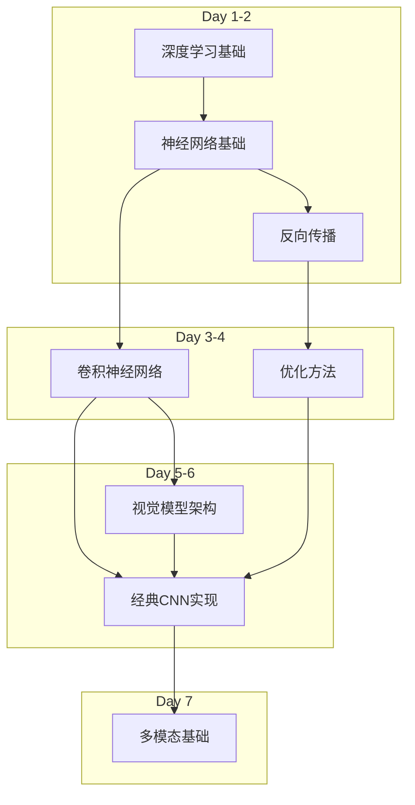

# 2024-W47-11

## 1 Plan

## 2 REVIEW

## 3 THOUGHTS

- 想要完善 obsidian 的模板捏
- 想要完善 prompt 系统
- 想要完善电脑配置流程
- 想要完善 blog 发布系统
- 想要学习前端后端
- 想要部署一个 anti-AIdetector
- 想要造一个每天记录的模板
- 想要多学一点多模态相关的东西
- 心理课
- 安全教育

## 4 LINKS

### Day 1（周一）：深度学习基础

## 上午（09:00-12:00）

##### 09:00-10:30 深度学习数学基础回顾

- 学习资源：
    - 课程：CS231n Lecture 1-2
    - 文档：[CS231n Python/Numpy Tutorial](http://cs231n.github.io/python-numpy-tutorial/)
    - 补充：[Deep Learning Book - Part I](https://www.deeplearningbook.org/)
- 实践任务：
    - NumPy 基础操作练习
    - 矩阵运算实现练习

##### 10:45-12:00 神经网络基础概念

- 学习内容：
    - 神经元模型
    - 激活函数
    - 前向传播
- 资源：
    - CS231n Lecture 3
    - [Neural Networks Part 1](http://cs231n.github.io/neural-networks-1/)

## 下午（14:00-17:00）

##### 14:00-15:30 实现基础神经网络组件

- 项目实践：
    - 从零实现简单神经网络
    - 实现不同激活函数
- 参考：CS231n assignment1 部分

##### 15:45-17:00 损失函数与梯度

- 学习内容：
    - 常见损失函数
    - 梯度计算基础
- 资源：
    - CS231n Lecture 3 相关部分
    - [损失函数笔记](http://cs231n.github.io/neural-networks-2/)

### Day 2（周二）：反向传播与优化基础

## 上午（09:00-12:00）

##### 09:00-10:30 反向传播理论

- 学习资源：
    - 课程：CS231n Lecture 4 - Backpropagation
    - 文档：[CS231n Backprop Notes](http://cs231n.github.io/optimization-2/)
    - 补充：[Andrej Karpathy - Backprop Blog](https://medium.com/@karpathy/yes-you-should-understand-backprop-e2f06eab496b)
- 实践任务：
    - 手算简单网络的反向传播
    - 绘制计算图

##### 10:45-12:00 优化器基础

- 学习内容：
    - SGD原理
    - Momentum
    - Adam优化器
- 资源：
    - CS231n Lecture 7 第一部分
    - PyTorch优化器文档

## 下午（14:00-17:00）

##### 14:00-15:30 实现反向传播

- 项目实践：
    - 从零实现两层神经网络的反向传播
    - CS231n assignment1: Two Layer Net
- 评估标准：
    - 准确实现反向传播算法
    - 损失函数收敛曲线正常

##### 15:45-17:00 优化器实现

- 实践项目：
    - 实现基础SGD优化器
    - 对比不同优化器效果
- 完成标准：
    - 优化器正确工作
    - 理解不同优化器的优劣

### Day 3（周三）：卷积神经网络基础

## 上午（09:00-12:00）

##### 09:00-10:30 CNN原理

- 学习内容：
    - 卷积运算原理
    - 池化层原理
    - 感受野计算
- 资源：
    - CS231n Lecture 5 - CNNs
    - [CNN笔记](http://cs231n.github.io/convolutional-networks/)

##### 10:45-12:00 CNN架构设计

- 学习内容：
    - 典型CNN结构
    - 架构设计原则
    - AlexNet/VGG解析
- 资源：
    - 相关论文精读
    - CS231n CNN Architectures

## 下午（14:00-17:00）

##### 14:00-15:30 CNN组件实现

- 实践项目：
    - 实现2D卷积层
    - 实现最大池化层
    - 实现基础CNN网络
- 评估要求：
    - 正确实现前向传播
    - 正确实现反向传播

##### 15:45-17:00 CNN训练实践

- 项目实践：
    - MNIST数据集上训练CNN
    - 可视化卷积层输出
- 完成标准：
    - 模型收敛且准确率>98%
    - 理解特征图含义

### Day 4（周四）：现代CNN架构

## 上午（09:00-12:00）

##### 09:00-10:30 ResNet深入

- 学习内容：
    - 残差连接原理
    - 深度网络训练难点
    - ResNet变体
- 资源：
    - ResNet论文
    - CS231n 现代架构部分

##### 10:45-12:00 现代架构创新

- 学习内容：
    - MobileNet/EfficientNet
    - 注意力机制
    - Vision Transformer入门
- 资源：
    - 相关论文快读
    - 架构演进总结

## 下午（14:00-17:00）

##### 14:00-15:30 ResNet实现

- 项目实践：
    - 实现基础ResNet块
    - 构建小型ResNet
- 评估标准：
    - 正确实现残差连接
    - 验证训练收敛性

##### 15:45-17:00 模型分析实验

- 实践项目：
    - 对比不同深度网络性能
    - 可视化残差连接效果
- 完成指标：
    - 完成对比实验
    - 理解深度网络特点

### Day 5（周五）：视觉模型训练技巧

## 上午（09:00-12:00）

##### 09:00-10:30 训练技巧理论

- 学习内容：
    - 数据增强
    - 正则化方法
    - 学习率调度
- 资源：
    - CS231n优化技巧部分
    - PyTorch训练最佳实践

##### 10:45-12:00 模型评估方法

- 学习内容：
    - 评估指标选择
    - 交叉验证
    - 模型诊断
- 资源：
    - 实践指南文档
    - 案例分析

## 下午（14:00-17:00）

##### 14:00-15:30 训练技巧实践

- 项目实践：
    - 实现常用数据增强
    - 测试不同正则化方法
    - 实现学习率调度
- 评估标准：
    - 正确实现各种技巧
    - 理解效果差异

##### 15:45-17:00 模型诊断实践

- 实践项目：
    - 过拟合/欠拟合分析
    - 绘制诊断曲线
    - 模型调优
- 完成标准：
    - 熟练使用诊断工具
    - 能够改进模型性能

### Day 6（周六）：深度实践日

## 上午（09:00-12:00）

##### 09:00-10:30 项目启动

- 实践项目：
    - 选择数据集
    - 设计模型架构
    - 规划实验方案
- 目标：完整训练流程实践

##### 10:45-12:00 模型实现

- 编码实践：
    - 搭建模型架构
    - 实现训练流程
    - 设计实验对比

## 下午（14:00-18:00）

##### 14:00-16:00 训练与优化

- 实践内容：
    - 执行模型训练
    - 进行消融实验
    - 分析实验结果

##### 16:15-18:00 结果分析

- 总结内容：
    - 撰写实验报告
    - 可视化分析
    - 归纳经验教训

### Day 7（周日）：多模态基础与总结

## 上午（09:00-12:00）

##### 09:00-10:30 多模态基础

- 学习内容：
    - 多模态表示学习
    - 跨模态对齐
    - 典型架构介绍
- 资源：
    - CLIP论文
    - 多模态综述

##### 10:45-12:00 前沿进展

- 学习内容：
    - 大模型发展
    - 多模态预训练
    - 研究方向分析

## 下午（14:00-18:00）

##### 14:00-16:00 知识总结

- 总结任务：
    - 回顾核心概念
    - 整理实践经验
    - 分析知识图谱

##### 16:15-18:00 研究规划

- 规划内容：
    - 确定研究方向
    - 制定后续计划
    - 建立知识体系

## 学习资源总览

### 1. 核心课程资源

- CS231n at Stanford
    - 平台：YouTube & Stanford官网
    - 重点章节：Lecture 1-10
    - 配套作业：assignment1, assignment2
    - 预计时间分配：每节课1.5小时(视频) + 2-3小时(实践)

### 2. 补充学习资源

- Deep Learning Book (Goodfellow)
    - 重点章节：Part I (Applied Math)，Part II (Modern Practices)
    - 建议：重点关注数学基础章节

### 3. 实践项目

- CS231n Assignments
    - 难度：进阶
    - 预计耗时：每个作业8-10小时
    - 重点：knn, svm, softmax, two-layer net

### 4. 论文阅读

入门论文清单：

1. AlexNet
2. VGG
3. ResNet
4. Transformer

### 5. 开发工具

- PyTorch
- Jupyter Notebook
- Google Colab (免费GPU)
- [项目实践](%E9%A1%B9%E7%9B%AE%E5%AE%9E%E8%B7%B5.md)