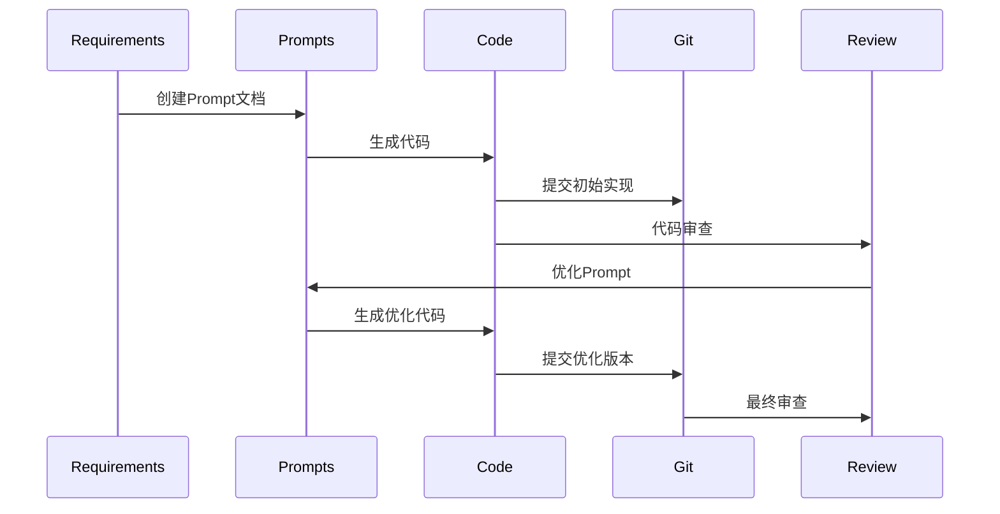

```thinking
需要提供一个完整、具体的工作流示例，从需求到最终代码提交。重点展示：
1. Obsidian文档的具体写法
2. 代码实现的具体步骤
3. Git操作的详细流程
4. 各个工具之间的联系

将通过一个具体的功能开发案例来展示整个流程。
```

# AI 辅助开发详细工作流示例

以开发一个用户认证系统为例，展示完整的开发流程。

## 一、需求分析与文档准备

### 1. 在 Obsidian 中创建项目结构

```
Project-Auth/
├── Features/
│   └── Authentication/
│       ├── Requirements.md
│       ├── Design.md
│       ├── Prompts/
│       │   ├── _index.md
│       │   ├── 01-basic-setup.md
│       │   ├── 02-jwt-implementation.md
│       │   └── 03-oauth-integration.md
│       ├── Implementation/
│       │   ├── _index.md
│       │   ├── 01-core-setup.md
│       │   ├── 02-jwt-service.md
│       │   └── 03-oauth-service.md
│       └── Reviews/
│           ├── _index.md
│           └── code-reviews.md
└── _templates/
```

### 2. 编写需求文档 ( `Requirements.md` )

```markdown
---
type: requirements
feature: authentication
status: planning
created: {{date}}
---

# Authentication System Requirements

## Overview
用户认证系统需要实现基于JWT的身份验证和OAuth2社交登录功能。

## Core Features
-  [ ]  JWT认证
  -  [ ]  Token生成和验证
  -  [ ]  Token刷新机制
  -  [ ]  Token黑名单
-  [ ]  OAuth2集成
  -  [ ]  Google登录
  -  [ ]  GitHub登录

## Technical Requirements
- Node.js + Express
- MongoDB数据库
- JWT加密标准
- OAuth2.0规范

## Related Documents
-  [[Design]]
-  [[Implementation/_index]]
-  [[Prompts/_index]]

## References
-  [JWT Specification] (https://jwt.io/)
-  [OAuth2 Documentation] (https://oauth.net/2/)
```

### 3. 创建设计文档 ( `Design.md` )

```markdown
---
type: design
feature: authentication
status: in-progress
created: {{date}}
---

# Authentication System Design

## Architecture
```mermaid
graph TD
    A[Client] --> B[Auth Controller]
    B --> C[JWT Service]
    B --> D[OAuth Service]
    C --> E[Database]
    D --> E


## Components

1. JWT Service
   - Token Generation
   - Token Validation
   - Refresh Logic

2. OAuth Service
   - Provider Integration
   - Profile Mapping
   - Session Management

## Database Schema

```typescript
interface User {
  id: string;
  email: string;
  password?: string;
  oauth?: {
    provider: string;
    providerId: string;
  };
  tokens: {
    refresh: string;
    expires: Date;
  }[];
}


## API Endpoints

- `POST /auth/login`
- `POST /auth/register`
- `POST /auth/refresh`
- `GET /auth/oauth/:provider`
- `GET /auth/oauth/:provider/callback`

## Related Documents

- [[Requirements]]
- [[Implementation/_index]]

```

## 二、开发流程示例

### 1. 创建第一个Prompt文档 (`Prompts/01-basic-setup.md`)

```markdown
---
type: prompt
feature: authentication
component: core
status: in-progress
git_branch: feature/ai-exp/auth-core
created: {{date}}
---

# Basic Authentication Setup

## Context
需要实现基础的用户认证系统，包括用户模型和核心认证服务。

## Current State
- 新项目初始化
- 已安装基础依赖
- 数据库配置完成

## Prompt Generation

### Initial Setup Prompt
```prompt
请帮我创建一个基于Express和MongoDB的用户认证系统的基础结构，包括：
1. 用户模型（User Schema）
2. 认证控制器（Auth Controller）
3. 基础中间件（Auth Middleware）

技术要求：
- 使用TypeScript
- 使用Express框架
- 使用Mongoose作为ODM
- 遵循RESTful API设计
- 使用适当的错误处理机制

请提供完整的代码实现。
``

## AI Response

[AI 的完整回答]

## Implementation Steps

1. 创建项目结构

   ```bash
   src/
   ├── models/
   │   └── user.model.ts
   ├── controllers/
   │   └── auth.controller.ts
   ├── middleware/
   │   └── auth.middleware.ts
   └── types/
       └── auth.types.ts


2. Git 分支创建

   ```bash
   git checkout -b feature/ai-exp/auth-core


3. 代码实现位置
   - Models: `src/models/user.model.ts`
   - Controller: `src/controllers/auth.controller.ts`
   - Middleware: `src/middleware/auth.middleware.ts`

## Code Review Notes

- [ ] 检查类型定义
- [ ] 验证错误处理
- [ ] 确认安全最佳实践

## Related

- [01-core-setup](Implementation/01-core-setup.md)
- [Requirements > Core Features](Requirements.md#Core%20Features)
```

### 2. 创建实现记录 (`Implementation/01-core-setup.md`)

```markdown
---
type: implementation
feature: authentication
component: core
status: in-progress
git_branch: feature/ai-exp/auth-core
created: {{date}}
---

# Core Authentication Setup Implementation

## Overview
实现认证系统的基础架构，包括用户模型和核心服务。

## AI Assistance Used
- [01-basic-setup](Prompts/01-basic-setup.md)

## Code Implementation

### 1. User Model
```typescript
// src/models/user.model.ts
import mongoose, { Schema, Document } from 'mongoose';

export interface IUser extends Document {
  email: string;
  password: string;
  createdAt: Date;
}

const UserSchema: Schema = new Schema({
  email: { type: String, required: true, unique: true },
  password: { type: String, required: true },
  createdAt: { type: Date, default: Date.now }
});

export default mongoose.model<IUser>('User', UserSchema);


### 2. Auth Controller

```typescript
// src/controllers/auth.controller.ts
import { Request, Response } from 'express';
import User, { IUser } from '../models/user.model';

export class AuthController {
  async register(req: Request, res: Response) {
    try {
      const user = new User(req.body);
      await user.save();
      res.status(201).json({ success: true });
    } catch (error) {
      res.status(400).json({ error: error.message });
    }
  }
}


## Git Commits

```bash
# 初始化项目结构
git add .
git commit -m "ai-raw: Initialize authentication system structure

Prompt: [[Prompts/01-basic-setup#Initial Setup Prompt]]
Implementation: [[Implementation/01-core-setup]]

- Add user model
- Add authentication controller
- Setup basic middleware"


## Testing

```typescript
// tests/auth.test.ts
describe('Auth System', () => {
  it('should register new user', async () => {
    // test implementation
  });
});


## Related

- [Requirements](Requirements.md)
- [Design](Design.md)
- [code-reviews](Reviews/code-reviews.md)
```

### 3. 代码审查记录 (`Reviews/code-reviews.md`)

```markdown
---
type: review
feature: authentication
component: core
status: in-progress
created: {{date}}
---

# Authentication System Code Reviews

## Core Setup Review

### Review Notes for [01-core-setup](Implementation/01-core-setup.md)
1. 代码质量
   - [x] 类型定义完整
   - [x] 错误处理合理
   - [ ] 需要添加密码哈希处理

2. 安全性
   - [ ] 添加密码复杂度验证
   - [ ] 实现登录尝试限制
   - [ ] 添加请求速率限制

3. 性能
   - [x] 数据库索引合理
   - [x] 异步操作处理正确

### Required Changes
```typescript
// 密码哈希处理
import bcrypt from 'bcrypt';

UserSchema.pre('save', async function(next) {
  if (this.isModified('password')) {
    this.password = await bcrypt.hash(this.password, 10);
  }
  next();
});


## Related

- [[Implementation/01-core-setup]]
- [[Prompts/01-basic-setup]]
```

## 三、工作流程详解

### 1. 功能开发完整流程



### 2. Git 工作流

```bash
# 1. 创建功能分支
git checkout -b feature/ai-exp/auth-core

# 2. 初始代码提交
git add src/
git commit -m "ai-raw: Initial authentication system

Prompt: [[Prompts/01-basic-setup]]
Implementation: [[Implementation/01-core-setup]]"

# 3. 优化提交
git add src/
git commit -m "ai-ref: Add password hashing

Based on review: [[Reviews/code-reviews#Required Changes]]"

# 4. 合并到开发分支
git checkout develop
git merge --no-ff feature/ai-exp/auth-core
```

### 3. VSCode 集成

1. 创建工作区

```json
{
    "folders": [
        {
            "path": "auth-system-code"
        },
        {
            "path": "auth-system-docs"
        }
    ],
    "settings": {
        "files.associations": {
            "*.prompt": "markdown"
        }
    }
}
```

2. 任务配置

```json
{
    "version": "2.0.0",
    "tasks": [
        {
            "label": "Create Prompt",
            "type": "shell",
            "command": "cp ${workspaceFolder}/auth-system-docs/_templates/prompt.md ${workspaceFolder}/auth-system-docs/Prompts/${input:promptName}.md",
            "problemMatcher": []
        }
    ]
}
```

## 四、最佳实践建议

### 1. Obsidian 使用技巧

1. 使用模板函数自动填充元数据
2. 创建数据视图查询常用信息
3. 使用标签系统组织文档
4. 定期回顾和优化文档结构

### 2. 文档命名规范

1. Prompt 文档： `XX-feature-component.md`
2. 实现文档： `XX-component-implementation.md`
3. 审查文档： `YYYY-MM-DD-review.md`

### 3. Git 提交规范

1. 使用前缀标识提交类型：
   - `ai-raw` : AI 生成的初始代码
   - `ai-ref` : AI 代码的优化版本
   - `manual` : 手动修改
   - `docs` : 文档更新

2. 提交信息格式：

```
<type>: <description>

Prompt: [[path/to/prompt#section]]
Implementation: [[path/to/implementation]]

- Change 1
- Change 2
```

需要我更详细地解释任何部分吗？这个工作流程主要确保：

1. 所有的开发过程都有完整的文档记录
2. 代码实现可以追溯到具体的 Prompt
3. 知识可以有效积累和复用
4. 团队协作更加规范和高效