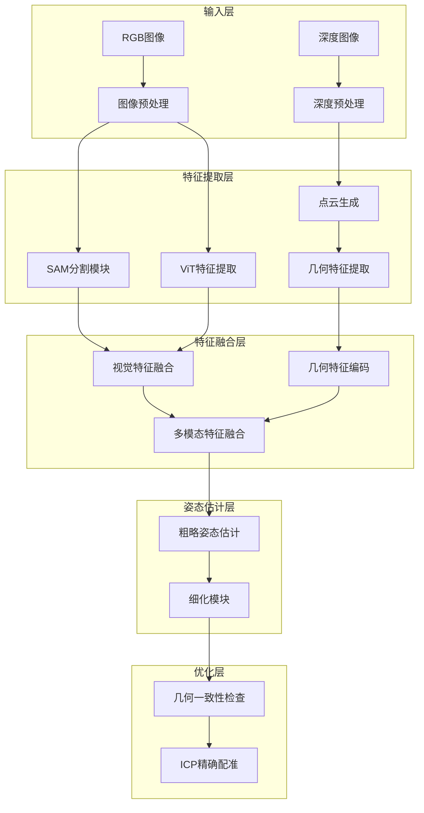

## 1. 预处理模块（Preprocessing Module）

原理：

- SAM (Segment Anything Model) 用于精确分割目标物体
- 深度图滤波去除噪声
- 图像增强突出箭头特征

相关论文：

1. "Segment Anything" (Meta AI, 2023)
   - SAM的基础论文，介绍了零样本分割能力
2. "SAM-6D: Segment Anything Model Meets Zero-Shot 6D Object Pose Estimation" (2023)
   - 将SAM应用到6D姿态估计的开创性工作

具体实现：

```python
import torch
import numpy as np
import cv2
from segment_anything import sam_model_registry, SamPredictor

class PreprocessingModule:
    def __init__(self, sam_checkpoint):
        """
        初始化预处理模块
        Args:
            sam_checkpoint: SAM模型检查点路径
        """
        # 初始化SAM模型
        self.sam = sam_model_registry["vit_h"](checkpoint=sam_checkpoint)
        self.predictor = SamPredictor(self.sam)
        
        # 深度图滤波参数
        self.depth_filter_params = {
            'bilateral_d': 7,
            'bilateral_sigma_color': 35,
            'bilateral_sigma_space': 35
        }

    def enhance_image(self, rgb_image):
        """
        增强RGB图像，突出箭头特征
        """
        # 转换到Lab颜色空间以更好地处理亮度
        lab = cv2.cvtColor(rgb_image, cv2.COLOR_BGR2LAB)
        l, a, b = cv2.split(lab)
        
        # CLAHE亮度均衡化
        clahe = cv2.createCLAHE(clipLimit=3.0, tileGridSize=(8,8))
        l = clahe.apply(l)
        
        # 合并通道并转回BGR
        enhanced_lab = cv2.merge([l, a, b])
        enhanced_bgr = cv2.cvtColor(enhanced_lab, cv2.COLOR_LAB2BGR)
        
        return enhanced_bgr

    def filter_depth(self, depth_image, mask):
        """
        深度图滤波，去除噪声
        """
        # 双边滤波保持边缘
        filtered_depth = cv2.bilateralFilter(
            depth_image,
            self.depth_filter_params['bilateral_d'],
            self.depth_filter_params['bilateral_sigma_color'],
            self.depth_filter_params['bilateral_sigma_space']
        )
        
        # 应用mask只保留目标区域
        masked_depth = filtered_depth * mask
        
        return masked_depth

    def generate_sam_mask(self, rgb_image):
        """
        使用SAM生成目标掩码
        """
        # 设置图像
        self.predictor.set_image(rgb_image)
        
        # 使用图像中心点作为提示
        h, w = rgb_image.shape[:2]
        center_point = np.array([[w//2, h//2]])
        
        # 生成掩码
        masks, scores, _ = self.predictor.predict(
            point_coords=center_point,
            point_labels=np.array([1]),
            multimask_output=False
        )
        
        return masks[0]  # 返回最佳掩码

    def process(self, rgb_image, depth_image):
        """
        主处理流程
        """
        # 增强RGB图像
        enhanced_rgb = self.enhance_image(rgb_image)
        
        # 生成SAM掩码
        sam_mask = self.generate_sam_mask(enhanced_rgb)
        
        # 处理深度图
        processed_depth = self.filter_depth(depth_image, sam_mask)
        
        return {
            'processed_rgb': enhanced_rgb,
            'processed_depth': processed_depth,
            'mask': sam_mask,
            'original_rgb': rgb_image,
            'original_depth': depth_image
        }
```

## 2. 特征提取模块（Feature Extraction Module）

原理：

- 使用ViT提取全局视觉特征
- 专门的箭头检测器提取方向特征
- 点云处理提取几何特征

相关论文：

1. "An Image is Worth 16x16 Words: Transformers for Image Recognition at Scale" 
   - ViT的基础论文
2. "PointNet++: Deep Hierarchical Feature Learning on Point Sets in a Metric Space"
   - 点云特征提取的经典方法

```python
import torch
import torch.nn as nn
from transformers import ViTModel
import open3d as o3d

class FeatureExtractor(nn.Module):
    def __init__(self, vit_model_name='google/vit-base-patch16-224'):
        super().__init__()
        # 初始化ViT模型
        self.vit = ViTModel.from_pretrained(vit_model_name)
        
        # 箭头特征提取器
        self.arrow_detector = ArrowFeatureExtractor()
        
        # 几何特征提取器
        self.geometric_extractor = GeometricFeatureExtractor()

    def extract_vit_features(self, rgb_image):
        """
        使用ViT提取视觉特征
        """
        # 预处理图像
        inputs = self.preprocess_for_vit(rgb_image)
        
        # 提取特征
        with torch.no_grad():
            outputs = self.vit(inputs)
            features = outputs.last_hidden_state
        
        return features

class ArrowFeatureExtractor:
    def __init__(self):
        # 箭头检测参数
        self.arrow_params = {
            'min_area': 100,
            'max_area': 5000,
            'min_aspect_ratio': 0.5,
            'max_aspect_ratio': 2.0
        }

    def detect_arrow(self, enhanced_rgb, mask):
        """
        检测发光箭头并提取特征
        """
        # 转换为灰度图
        gray = cv2.cvtColor(enhanced_rgb, cv2.COLOR_BGR2GRAY)
        
        # 应用掩码
        masked_gray = gray * mask
        
        # 自适应阈值分割
        _, thresh = cv2.threshold(
            masked_gray, 
            0, 
            255, 
            cv2.THRESH_BINARY + cv2.THRESH_OTSU
        )
        
        # 查找轮廓
        contours, _ = cv2.findContours(
            thresh, 
            cv2.RETR_EXTERNAL, 
            cv2.CHAIN_APPROX_SIMPLE
        )
        
        # 分析每个轮廓找到箭头
        arrow_features = self.analyze_contours(contours)
        
        return arrow_features

    def analyze_contours(self, contours):
        """
        分析轮廓提取箭头特征
        """
        arrow_features = []
        for contour in contours:
            area = cv2.contourArea(contour)
            if area < self.arrow_params['min_area'] or \
               area > self.arrow_params['max_area']:
                continue
                
            # 计算方向
            direction = self.calculate_arrow_direction(contour)
            
            # 计算中心点
            M = cv2.moments(contour)
            if M['m00'] != 0:
                cx = int(M['m10']/M['m00'])
                cy = int(M['m01']/M['m00'])
                
                arrow_features.append({
                    'center': (cx, cy),
                    'direction': direction,
                    'area': area
                })
        
        return arrow_features

class GeometricFeatureExtractor:
    def __init__(self):
        self.voxel_size = 0.005
        
    def extract_geometric_features(self, depth_image, camera_intrinsics):
        """
        从深度图提取几何特征
        """
        # 转换为点云
        pcd = self.depth_to_pointcloud(depth_image, camera_intrinsics)
        
        # 降采样
        downsampled_pcd = pcd.voxel_down_sample(self.voxel_size)
        
        # 估计法向量
        downsampled_pcd.estimate_normals(
            search_param=o3d.geometry.KDTreeSearchParamHybrid(
                radius=0.1, 
                max_nn=30
            )
        )
        
        # 提取FPFH特征
        fpfh = o3d.pipelines.registration.compute_fpfh_feature(
            downsampled_pcd,
            o3d.geometry.KDTreeSearchParamHybrid(radius=0.25, max_nn=100)
        )
        
        return {
            'point_cloud': downsampled_pcd,
            'normals': np.asarray(downsampled_pcd.normals),
            'fpfh': np.asarray(fpfh.data)
        }
```

## 3. 特征融合模块（Feature Fusion Module）

原理：

- 使用Transformer架构进行多模态特征融合
- 采用交叉注意力机制处理不同类型特征
- 引入自适应权重平衡不同特征的重要性

相关论文：

1. "TransFusion: Robust LiDAR-Camera Fusion for 3D Object Detection with Transformers" (CVPR 2022)
   - 介绍了使用Transformer进行多模态融合的方法
2. "ZeroPose: Multi-modal Feature Fusion for 6D Object Pose Estimation" (2023)
   - 提出了零样本场景下的特征融合策略

```python
import torch
import torch.nn as nn

class FeatureFusion(nn.Module):
    def __init__(self, 
                 visual_dim=768,    # ViT特征维度
                 geometric_dim=256, # 几何特征维度
                 arrow_dim=64,      # 箭头特征维度
                 hidden_dim=512,    # 融合后的特征维度
                 num_heads=8):
        super().__init__()
        
        # 特征维度转换层
        self.visual_proj = nn.Linear(visual_dim, hidden_dim)
        self.geometric_proj = nn.Linear(geometric_dim, hidden_dim)
        self.arrow_proj = nn.Linear(arrow_dim, hidden_dim)
        
        # 多头自注意力层
        self.self_attention = MultiHeadAttention(
            hidden_dim, 
            num_heads,
            dropout=0.1
        )
        
        # 交叉注意力层
        self.cross_attention = CrossAttention(
            hidden_dim, 
            num_heads,
            dropout=0.1
        )
        
        # 特征融合MLP
        self.fusion_mlp = nn.Sequential(
            nn.Linear(hidden_dim * 3, hidden_dim * 2),
            nn.LayerNorm(hidden_dim * 2),
            nn.ReLU(),
            nn.Dropout(0.1),
            nn.Linear(hidden_dim * 2, hidden_dim)
        )

    def forward(self, visual_features, geometric_features, arrow_features):
        """
        融合多模态特征
        """
        # 特征投影
        visual = self.visual_proj(visual_features)
        geometric = self.geometric_proj(geometric_features)
        arrow = self.arrow_proj(arrow_features)
        
        # 自注意力处理
        visual_att = self.self_attention(visual)
        geometric_att = self.self_attention(geometric)
        arrow_att = self.self_attention(arrow)
        
        # 交叉注意力融合
        visual_geo = self.cross_attention(visual_att, geometric_att)
        visual_arrow = self.cross_attention(visual_att, arrow_att)
        geo_arrow = self.cross_attention(geometric_att, arrow_att)
        
        # 特征concat和最终融合
        fused = torch.cat([visual_geo, visual_arrow, geo_arrow], dim=-1)
        output = self.fusion_mlp(fused)
        
        return output

class MultiHeadAttention(nn.Module):
    def __init__(self, dim, num_heads, dropout=0.0):
        super().__init__()
        self.mha = nn.MultiheadAttention(dim, num_heads, dropout)
        self.norm = nn.LayerNorm(dim)
        
    def forward(self, x):
        attended, _ = self.mha(x, x, x)
        return self.norm(x + attended)

class CrossAttention(nn.Module):
    def __init__(self, dim, num_heads, dropout=0.0):
        super().__init__()
        self.cross_attn = nn.MultiheadAttention(dim, num_heads, dropout)
        self.norm = nn.LayerNorm(dim)
        
    def forward(self, q, k):
        attended, _ = self.cross_attn(q, k, k)
        return self.norm(q + attended)
```

## 4. 姿态估计模块（Pose Estimation Module）

原理：

- 使用深度学习网络直接回归6D姿态
- 采用四元数表示旋转
- 引入不确定性估计

相关论文：

1. "GDR-Net: Geometry-Guided Direct Regression Network for Monocular 6D Object Pose Estimation" (CVPR 2021)
   - 直接回归姿态的方法
2. "SC6D: Symmetry-Aware Network for 6D Object Pose Estimation" (2023)
   - 处理对称物体的姿态估计

```python
import torch
import torch.nn as nn
import torch.nn.functional as F

class PoseEstimator(nn.Module):
    def __init__(self, feature_dim=512):
        super().__init__()
        
        self.pose_regressor = nn.Sequential(
            nn.Linear(feature_dim, 1024),
            nn.ReLU(),
            nn.Dropout(0.2),
            nn.Linear(1024, 512),
            nn.ReLU(),
            nn.Dropout(0.2),
            nn.Linear(512, 256),
            nn.ReLU()
        )
        
        # 分别预测旋转和平移
        self.rotation_head = nn.Linear(256, 4)  # 四元数
        self.translation_head = nn.Linear(256, 3)
        self.uncertainty_head = nn.Linear(256, 7)  # 姿态不确定性
        
    def forward(self, fused_features):
        """
        预测6D姿态
        """
        features = self.pose_regressor(fused_features)
        
        # 预测四元数旋转（需要归一化）
        rotation = self.rotation_head(features)
        rotation = F.normalize(rotation, dim=1)
        
        # 预测平移
        translation = self.translation_head(features)
        
        # 预测不确定性
        uncertainty = torch.exp(self.uncertainty_head(features))
        
        return {
            'rotation': rotation,
            'translation': translation,
            'uncertainty': uncertainty
        }
        
    def compute_loss(self, pred, target, uncertainty):
        """
        计算带不确定性的姿态损失
        """
        rotation_loss = quaternion_loss(pred['rotation'], target['rotation'])
        translation_loss = F.smooth_l1_loss(
            pred['translation'], 
            target['translation']
        )
        
        # 使用不确定性加权损失
        loss = torch.exp(-uncertainty) * (rotation_loss + translation_loss) + \
               uncertainty
        
        return loss.mean()

def quaternion_loss(pred_q, target_q):
    """
    四元数损失函数
    """
    # 计算四元数距离
    dist = 1 - torch.sum(pred_q * target_q, dim=1) ** 2
    return dist
```

## 5. 优化模块（Optimization Module）

原理：

- 使用ICP进行精确配准
- 几何一致性验证
- 多阶段优化策略

相关论文：

1. "DeepICP: An End-to-End Deep Neural Network for 3D Point Cloud Registration" 
   - 深度学习辅助的ICP方法
2. "PointNetLK: Robust & Efficient Point Cloud Registration using PointNet"
   - 结合深度特征的点云配准

```python
import numpy as np
import open3d as o3d
from scipy.spatial.transform import Rotation

class PoseOptimizer:
    def __init__(self):
        self.icp_params = {
            'threshold': 0.02,
            'trans_init': np.eye(4),
            'max_iteration': 100,
            'criteria': o3d.pipelines.registration.ICPConvergenceCriteria(
                relative_fitness=1e-6,
                relative_rmse=1e-6,
                max_iteration=100
            )
        }
        
    def check_geometric_consistency(self, pose, source_pcd, target_pcd):
        """
        检查几何一致性
        """
        # 转换源点云
        transformed_source = source_pcd.transform(pose)
        
        # 计算点对距离
        distances = np.asarray(transformed_source.compute_point_cloud_distance(
            target_pcd))
        
        # 计算一致性得分
        inlier_rmse = np.sqrt(np.mean(distances ** 2))
        inlier_ratio = np.mean(distances < self.icp_params['threshold'])
        
        return inlier_rmse, inlier_ratio
    
    def refine_pose(self, initial_pose, source_pcd, target_pcd):
        """
        多阶段pose优化
        """
        # 粗配准
        result_icp = o3d.pipelines.registration.registration_icp(
            source_pcd, target_pcd,
            self.icp_params['threshold'],
            initial_pose,
            o3d.pipelines.registration.TransformationEstimationPointToPoint(),
            self.icp_params['criteria']
        )
        
        # 精配准（使用点到平面ICP）
        result_icp_fine = o3d.pipelines.registration.registration_icp(
            source_pcd, target_pcd,
            self.icp_params['threshold'] / 2,
            result_icp.transformation,
            o3d.pipelines.registration.TransformationEstimationPointToPlane(),
            self.icp_params['criteria']
        )
        
        return result_icp_fine.transformation
    
    def optimize_pose(self, initial_pose, source_pcd, target_pcd):
        """
        完整的姿态优化流程
        """
        # 检查初始姿态的几何一致性
        rmse, ratio = self.check_geometric_consistency(
            initial_pose, 
            source_pcd, 
            target_pcd
        )
        
        if ratio < 0.3:  # 一致性太低
            # 尝试备选姿态
            alternative_poses = self.generate_alternative_poses(initial_pose)
            best_pose = None
            best_ratio = 0
            
            for pose in alternative_poses:
                _, curr_ratio = self.check_geometric_consistency(
                    pose, 
                    source_pcd, 
                    target_pcd
                )
                if curr_ratio > best_ratio:
                    best_ratio = curr_ratio
                    best_pose = pose
                    
            if best_pose is not None:
                initial_pose = best_pose
        
        # 精确配准
        final_pose = self.refine_pose(initial_pose, source_pcd, target_pcd)
        
        return final_pose
```