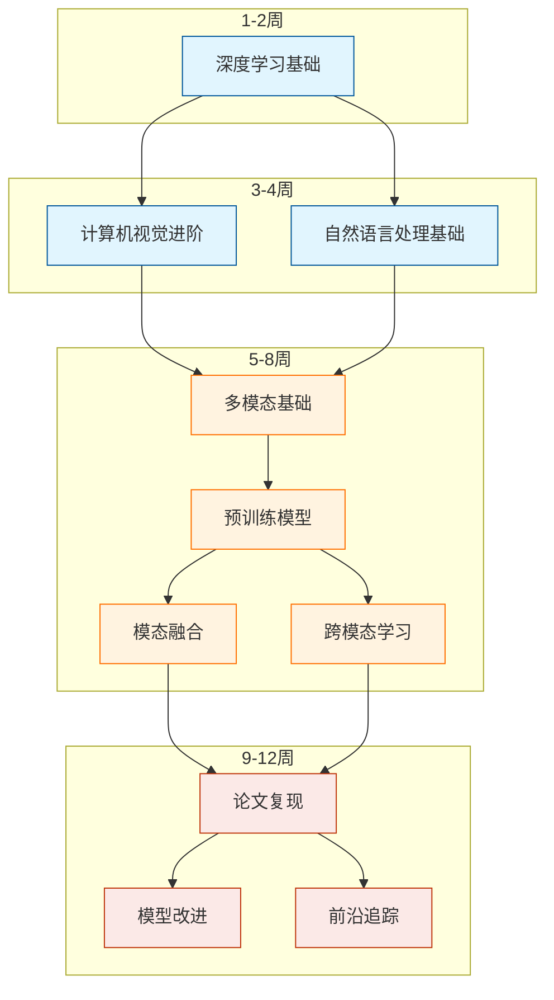

# 多模态深度学习研究方向学习规划

## 基本信息

- 学习方向：多模态深度学习研究
- 学习周期：3个月
- 时间投入：工作日6小时/天，周末4-6小时/天
- 预期目标：能够独立开发多模态模型并进行改进研究

## 学习路线图

## 学习资源总览

### 1. 课程资源

- Deep Learning with PyTorch
  - 平台：PyTorch 官网
  - 难度：基础到进阶
  - 重点章节：张量操作、自动求导、CNN 基础
  - 预计时间：1 周
  - 配套项目：图像分类实践
- Hugging Face Course
  - 平台：Hugging Face 官网
  - 难度：进阶
  - 重点章节：Transformers 库使用、多模态模型
  - 预计时间：2 周
  - 配套项目：CLIP 模型实践
- Multi-Modal Deep Learning
  - 平台：Stanford CS231n
  - 难度：高级
  - 重点章节：多模态表示学习、跨模态对齐
  - 预计时间：3 周
  - 配套项目：跨模态检索系统

### 2. 实践项目

- 基础图像分类器
  - 仓库地址：pytorch/examples/mnist
  - 难度：基础
  - 技术栈：PyTorch, CNN
  - 预计耗时：3 天
  - 实现功能：手写数字识别系统
- 跨模态检索系统
  - 仓库地址：openai/CLIP
  - 难度：中等
  - 技术栈：CLIP, PyTorch
  - 预计耗时：2 周
  - 实现功能：图文互检索
- 多模态预训练模型
  - 仓库地址：microsoft/BEiT
  - 难度：高级
  - 技术栈：Transformers, PyTorch
  - 预计耗时：3 周
  - 实现功能：视觉语言预训练

### 3. 技术博客与论文

- 论文解读系列
  - CLIP 论文：[Learning Transferable Visual Models](https://arxiv.org/abs/2103.00020)
  - BEiT 论文：[BEiT: BERT Pre-Training](https://arxiv.org/abs/2106.08254)
  - 阅读时间：每篇 1-2 天
- 技术博客
  - [The Illustrated Transformer](https://jalammar.github.io/illustrated-transformer/)
  - [Multi-Modal Deep Learning Guide](https://theaisummer.com/multimodal-deep-learning/)
  - [Vision Language Models Tutorial](https://www.pinecone.io/learn/vision-language-models/)

### 4. 官方文档

- PyTorch Documentation
  - 链接：https://pytorch.org/docs/stable/
  - 重点章节：nn 模块、优化器、数据加载
  - 配套示例：官方教程代码
- Hugging Face Transformers
  - 链接：https://huggingface.co/docs/transformers/
  - 重点章节：多模态模型、预训练模型使用
  - 配套示例：示例 notebooks

## 详细学习计划

### 第一阶段：深度学习基础强化（2 周）

#### Week 1: PyTorch 与深度学习基础

##### Day 1（周一）

###### 上午（09:00-12:00）

- 09:00-10:30 PyTorch 基础
  - 学习资源：
    - 课程：PyTorch 官方教程第 1 章
    - 文档：PyTorch 张量操作文档
    - 博客：PyTorch 入门指南
  - 练习项目：实现基础张量操作
- 10:45-12:00 自动求导机制
  - 学习资源：
    - 课程：PyTorch 自动求导教程
    - 文档：autograd 详解
  - 练习项目：实现简单神经网络

###### 下午（14:00-17:30）

- 14:00-15:30 神经网络基础
  - 学习内容：
    - 神经网络架构
    - 激活函数
    - 损失函数
  - 实践项目：手写数字识别
- 15:45-17:30 项目实践
  - 项目：MNIST 分类器
  - 任务：搭建基础模型架构
  - 目标：完成数据加载和模型定义

##### Day 2（周二）

###### 上午（09:00-12:00）

- 09:00-10:30 CNN 架构
  - 学习资源：
    - 课程：CS231n CNN 架构
    - 文档：PyTorch nn. Conv2d 文档
  - 练习：实现基础 CNN

##### Day 3（周三）

###### 上午（09:00-12:00）

- 09:00-10:30 优化器与学习率策略
  - 学习资源：
    - 课程：[Deep Learning Optimization](https://d2l.ai/chapter_optimization/index.html)
    - 文档：PyTorch优化器文档
    - 博客：[Optimizer解析](https://ruder.io/optimizing-gradient-descent/)
  - 实践内容：
    - 实现不同优化器
    - 对比优化效果
    - 可视化学习过程
- 10:45-12:00 批归一化与正则化
  - 学习资源：
    - 文档：BatchNorm论文解读
    - 实践：实现BN层
  - 重点内容：
    - BatchNorm原理
    - Dropout使用
    - 正则化方法

###### 下午（14:00-17:30）

- 14:00-15:30 数据加载与预处理
  - 学习内容：
    - Dataset类实现
    - DataLoader使用
    - 数据增强技术
  - 实践项目：
    - 图像数据处理流水线
    - 自定义数据集类
- 15:45-17:30 模型训练实践
  - 项目：ResNet实现
  - 任务：
    - 搭建模型架构
    - 实现训练循环
    - 添加验证流程

##### Day 4（周四）

###### 上午（09:00-12:00）

- 09:00-10:30 模型评估与调试
  - 学习资源：
    - 文档：PyTorch调试指南
    - 博客：深度学习模型调试技巧
  - 实践内容：
    - 性能评估指标
    - 过拟合诊断
    - 模型可视化
- 10:45-12:00 模型部署基础
  - 学习内容：
    - 模型保存加载
    - TorchScript使用
    - 模型量化技术

###### 下午（14:00-17:30）

- 14:00-15:30 分布式训练入门
  - 内容：
    - DataParallel使用
    - DDP基础概念
    - 多GPU训练
  - 实践：
    - 实现多GPU训练
    - 性能对比分析
- 15:45-17:30 第一周项目完善
  - 任务：
    - 优化模型性能
    - 添加日志记录
    - 实验结果分析

##### Day 5（周五）

###### 上午（09:00-12:00）

- 09:00-10:30 计算机视觉基础
  - 学习资源：
    - 课程：CS231n图像分类
    - 文档：torchvision文档
  - 内容：
    - CNN架构进阶
    - 特征提取器
    - 迁移学习
- 10:45-12:00 视觉模型实践
  - 项目：迁移学习实战
  - 任务：
    - 使用预训练模型
    - 微调网络
    - 特征可视化

###### 下午（14:00-17:30）

- 14:00-15:30 注意力机制基础
  - 学习资源：
    - 论文：Attention Is All You Need
    - 博客：图解Attention
  - 内容：
    - 自注意力机制
    - 多头注意力
    - Position Encoding
- 15:45-17:30 Transformer实践
  - 项目：简单Transformer实现
  - 任务：
    - 搭建基础架构
    - 实现自注意力
    - 训练简单任务

#### Week 2: 多模态基础与预训练模型

##### Day 6（周六）

###### 上午（09:00-12:00）

- 09:00-10:30 自然语言处理基础
  - 学习资源：
    - 课程：NLP基础概念
    - 文档：PyTorch NLP教程
  - 内容：
    - 文本预处理
    - 词嵌入技术
    - 序列模型
- 10:45-12:00 BERT模型解析
  - 学习资源：
    - 论文：BERT论文
    - 博客：BERT详解
  - 实践：
    - Hugging Face使用
    - 文本特征提取

###### 下午（14:00-17:30）

- 14:00-17:30 项目实战
  - 项目：文本分类器
  - 内容：
    - BERT微调
    - 文本特征提取
    - 模型评估

##### Day 7（周日）

###### 上午（09:00-12:00）

- 09:00-12:00 本周总结与复习
  - 内容：
    - 知识点回顾
    - 难点解析
    - 代码优化
  - 输出：
    - 学习总结文档
    - 优化后的代码
    - 下周计划

###### 下午（14:00-17:30）

- 14:00-17:30 预习下周内容
  - 学习资源：
    - 多模态论文阅读
    - CLIP模型预习
  - 准备工作：
    - 环境配置
    - 数据准备
    - 代码框架搭建

#### Week 3: 多模态基础与 CLIP 模型

##### Day 8（周一）

###### 上午（09:00-12:00）

- 09:00-10:30 多模态学习概述
  - 学习资源：
    - 论文：[Multimodal Machine Learning: A Survey and Taxonomy](https://arxiv.org/abs/1705.09406)
    - 课程：[MultiModal Deep Learning](https://cmu-multicomp-lab.github.io/mmml-course/fall2020/)
  - 重点内容：
    - 多模态表示学习
    - 模态融合方法
    - 跨模态迁移
  - 练习：整理多模态学习框架
- 10:45-12:00 CLIP 模型原理
  - 学习资源：
    - 论文：[Learning Transferable Visual Models](https://arxiv.org/abs/2103.00020)
    - 博客：[CLIP详解](https://openai.com/blog/clip/)
  - 重点内容：
    - 对比学习原理
    - 图文对齐方法
    - 零样本迁移

###### 下午（14:00-17:30）

- 14:00-15:30 CLIP 实践（一）
  - 项目：CLIP 模型复现
  - 任务：
    - 搭建模型架构
    - 实现图像编码器
    - 实现文本编码器
- 15:45-17:30 CLIP 实践（二）
  - 继续项目开发：
    - 实现对比损失
    - 构建数据加载器
    - 测试基础功能

##### Day 9（周二）

###### 上午（09:00-12:00）

- 09:00-10:30 图像编码器优化
  - 学习资源：
    - Vision Transformer 论文
    - MAE 模型解析
  - 实践内容：
    - 优化视觉特征提取
    - 实现注意力机制
    - 添加位置编码
- 10:45-12:00 文本编码器优化
  - 学习内容：
    - BERT/RoBERTa 原理
    - 文本预处理策略
  - 实践：
    - 优化文本特征提取
    - 实现文本增强

###### 下午（14:00-17:30）

- 14:00-15:30 模型训练与优化
  - 内容：
    - 实现训练循环
    - 添加验证流程
    - 设置优化策略
  - 具体任务：
    - 实现温度参数调整
    - 添加学习率调度
    - 实现梯度裁剪
- 15:45-17:30 评估与分析
  - 实验设置：
    - 零样本分类评估
    - 图文检索测试
    - 可视化分析
  - 改进方向：
    - 模型结构优化
    - 训练策略调整
    - 数据增强方法

##### Day 10（周三）

###### 上午（09:00-12:00）

- 09:00-10:30 模态融合技术
  - 学习资源：
    - 论文：[Multimodal Fusion Techniques](https://arxiv.org/abs/2011.12373)
    - 博客：模态融合最佳实践
  - 内容：
    - 早期融合
    - 晚期融合
    - 注意力融合
- 10:45-12:00 融合策略实践
  - 项目：改进 CLIP 模型
  - 任务：
    - 实现不同融合方法
    - 对比性能差异
    - 分析最佳策略

###### 下午（14:00-17:30）

- 14:00-15:30 跨模态注意力
  - 学习内容：
    - 交叉注意力机制
    - 协同注意力网络
    - 动态融合策略
  - 实践：
    - 实现交叉注意力
    - 测试性能提升
- 15:45-17:30 模型改进实践
  - 改进方向：
    - 添加交叉注意力
    - 优化特征对齐
    - 实现动态融合

##### Day 11（周四）

###### 上午（09:00-12:00）

- 09:00-10:30 多模态数据增强
  - 学习内容：
    - 图像增强技术
    - 文本增强方法
    - 跨模态增强策略
  - 实践：
    - 实现数据增强
    - 测试效果提升
- 10:45-12:00 性能优化技术
  - 内容：
    - 混合精度训练
    - 分布式训练
    - 模型剪枝量化
  - 实践：
    - 实现 FP16 训练
    - 测试加速效果

###### 下午（14:00-17:30）

- 14:00-15:30 应用场景拓展
  - 探索方向：
    - 图像检索优化
    - 零样本分类改进
    - 新场景应用
  - 实践：
    - 实现新应用
    - 评估模型泛化性
- 15:45-17:30 实验分析与总结
  - 任务：
    - 整理实验数据
    - 分析性能瓶颈
    - 规划改进方向

##### Day 12（周五）

###### 上午（09:00-12:00）

- 09:00-10:30 前沿论文阅读
  - 论文列表：
    - [ALBEF](https://arxiv.org/abs/2107.07651)
    - [BLIP](https://arxiv.org/abs/2201.12086)
    - [Florence](https://arxiv.org/abs/2111.11432)
  - 要点：
    - 创新点分析
    - 性能对比
    - 可借鉴之处
- 10:45-12:00 改进方案设计
  - 内容：
    - 总结模型优势
    - 找出改进空间
    - 设计创新点

###### 下午（14:00-17:30）

- 14:00-15:30 改进实施
  - 任务：
    - 实现改进方案
    - 进行对比实验
    - 分析效果提升
- 15:45-17:30 周总结与规划
  - 内容：
    - 总结本周进展
    - 分析存在问题
    - 规划下周任务

#### Week 4: 高级多模态架构与预训练

##### Day 13（周一）

###### 上午（09:00-12:00）

- 09:00-10:30 预训练模型架构
  - 学习资源：
    - 论文：[BEiT论文](https://arxiv.org/abs/2106.08254)
    - 文档：[Hugging Face预训练指南](https://huggingface.co/docs/transformers/training)
  - 重点内容：
    - 掩码图像建模
    - 自监督学习策略
    - 预训练目标设计
- 10:45-12:00 预训练数据准备
  - 任务：
    - 数据收集与清洗
    - 构建预训练数据集
    - 实现数据处理流水线
  - 实践：
    - 编写数据处理脚本
    - 测试数据加载效率

###### 下午（14:00-17:30）

- 14:00-15:30 预训练模型实现
  - 项目：多模态预训练模型
  - 任务：
    - 实现模型架构
    - 设计预训练任务
    - 构建损失函数
- 15:45-17:30 训练流程搭建
  - 实现内容：
    - 训练循环设计
    - 验证流程构建
    - 指标监控系统

##### Day 14（周二）

###### 上午（09:00-12:00）

- 09:00-10:30 分布式训练优化
  - 学习内容：
    - DDP 高级用法
    - 梯度累积实现
    - 混合精度训练
  - 实践：
    - 配置分布式环境
    - 优化训练性能
- 10:45-12:00 模型调试与监控
  - 工具使用：
    - Weights & Biases 设置
    - TensorBoard 配置
    - 日志系统搭建
  - 实践：
    - 实现可视化监控
    - 设置调试断点

###### 下午（14:00-17:30）

- 14:00-15:30 预训练实验
  - 实验设置：
    - 启动预训练任务
    - 监控训练进程
    - 记录实验数据
  - 优化方向：
    - 调整批次大小
    - 优化学习率策略
    - 处理内存问题
- 15:45-17:30 中间结果分析
  - 分析内容：
    - 损失曲线分析
    - 特征可视化
    - 性能瓶颈排查
  - 改进：
    - 调整模型参数
    - 优化训练策略

##### Day 15（周三）

###### 上午（09:00-12:00）

- 09:00-10:30 下游任务设计
  - 任务类型：
    - 图文检索改进
    - 视觉问答实现
    - 图像描述生成
  - 设计：
    - 任务适配层
    - 微调策略
    - 评估方法
- 10:45-12:00 任务适配实现
  - 实践内容：
    - 实现任务头
    - 设计微调流程
    - 构建评估指标

###### 下午（14:00-17:30）

- 14:00-15:30 微调实验
  - 实验内容：
    - 不同任务微调
    - 对比实验设计
    - 性能评估
- 15:45-17:30 结果分析与改进
  - 分析内容：
    - 各任务性能分析
    - 错误案例分析
    - 改进方向确定

##### Day 16（周四）

###### 上午（09:00-12:00）

- 09:00-10:30 多任务学习
  - 学习资源：
    - 论文：[MultiBERTs](https://arxiv.org/abs/2106.16163)
    - 博客：多任务学习最佳实践
  - 内容：
    - 任务平衡策略
    - 梯度调制方法
    - 知识共享机制
- 10:45-12:00 多任务实现
  - 实践内容：
    - 实现任务调度
    - 设计损失权重
    - 构建评估系统

###### 下午（14:00-17:30）

- 14:00-15:30 性能优化
  - 优化方向：
    - 内存使用优化
    - 推理速度提升
    - 模型压缩尝试
  - 实践：
    - 实现模型量化
    - 测试推理性能
- 15:45-17:30 部署准备
  - 内容：
    - 模型导出
    - 推理优化
    - 部署文档

##### Day 17（周五）

###### 上午（09:00-12:00）

- 09:00-10:30 模型部署
  - 部署平台：
    - ONNX 转换
    - TorchScript
    - TensorRT
  - 实践：
    - 模型格式转换
    - 性能测试对比
- 10:45-12:00 服务化实现
  - 内容：
    - RESTful API 设计
    - 服务容器化
    - 负载均衡

###### 下午（14:00-17:30）

- 14:00-15:30 Demo 系统开发
  - 功能实现：
    - Web 界面设计
    - 接口对接
    - 结果展示
- 15:45-17:30 文档编写
  - 内容：
    - 技术文档
    - 接口文档
    - 部署说明

##### Day 18-19（周末）

###### 项目总结与论文阅读

- 项目总结：
  - 整理实验数据
  - 撰写技术报告
  - 总结创新点
- 前沿论文阅读：
  - 最新顶会论文
  - 相关工作对比
  - 未来方向规划

[需要继续展开后续内容吗？]

当前阶段重要提示：

1. 关注预训练模型的训练效率
2. 重视实验结果的可复现性
3. 保持详细的实验记录
4. 及时整理和总结经验

您需要我继续展开：

1. 后续几周的详细计划
2. 特定技术点的深入讲解
3. 更多实验细节
4. 评估方法的具体实施

#### 第一个月

- 完成深度学习基础学习
- 掌握 PyTorch 开发
- 完成基础项目实践
- 理解多模态基本概念

#### 第二个月

- 掌握 Transformers 架构
- 学习 CLIP 等经典模型
- 完成跨模态检索项目
- 开始论文复现工作

#### 第三个月

- 深入多模态预训练
- 完成模型改进实验
- 跟踪领域前沿论文
- 形成研究方向